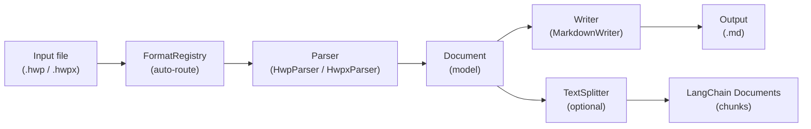
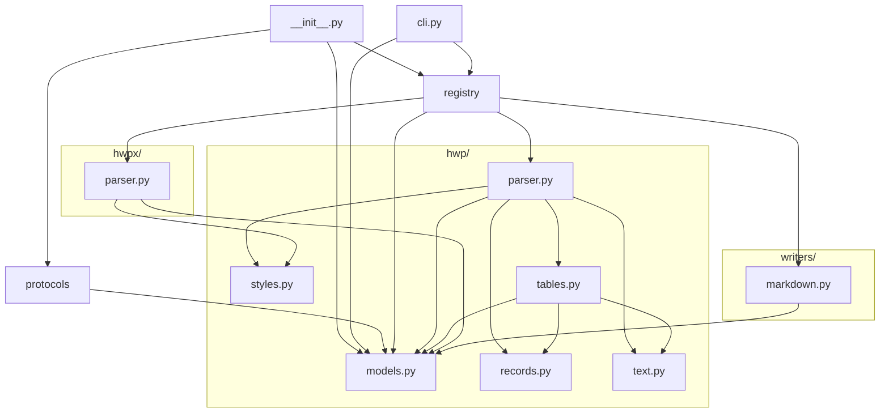
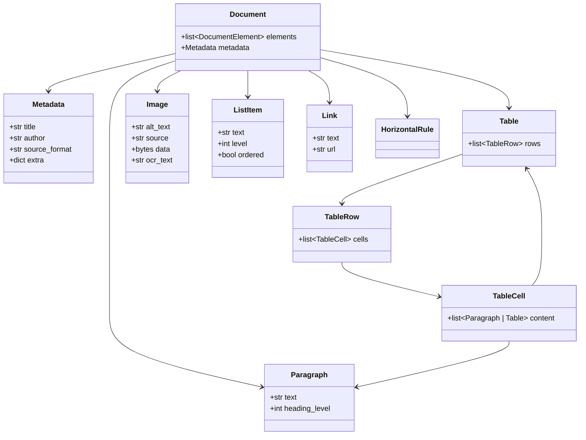
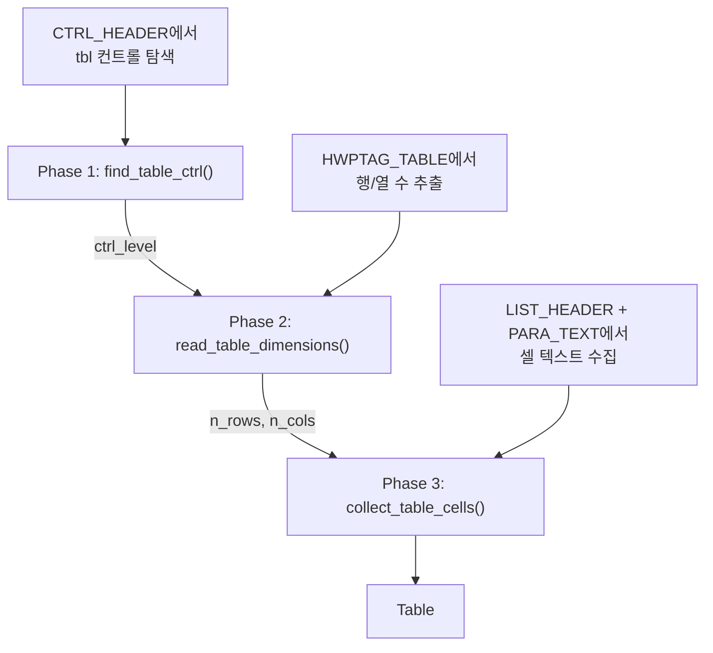

# 아키텍처

## 파이프라인

입력 파일이 변환되는 전체 흐름이에요.



## 모듈 의존성 그래프

각 모듈이 어떤 모듈에 의존하는지 보여줘요. 화살표 방향이 의존 방향이에요.



핵심 원칙은 **파서와 Writer가 `models.py`에만 의존**하는 거예요. 서로를 직접 import하지 않아요.

## Document 모델

`Document`는 파싱 결과의 중간 표현(IR)이에요. 모든 파서는 이 모델을 생산하고, 모든 Writer는 이 모델을 소비해요.



## FormatRegistry

`FormatRegistry`는 파서와 Writer를 중앙에서 관리하는 레지스트리예요.

- **파서 등록** — 파일 확장자(`.hwp`, `.hwpx`)를 키로 파서 클래스를 매핑해요
- **Writer 등록** — 포맷 이름(`markdown`)을 키로 Writer 클래스를 매핑해요
- **자동 등록** — `get_registry()`를 최초 호출하면 `_auto_register()`가 내장 파서/Writer를 등록해요
- **선택적 의존성** — `try/except ImportError`로 처리해서 없는 의존성은 건너뛰어요

## Protocol 기반 인터페이스

ABC 대신 `typing.Protocol`을 사용해서 구조적 서브타이핑을 구현했어요.

```python
class Parser(Protocol):
    @staticmethod
    def extensions() -> list[str]: ...
    @staticmethod
    def parse(filepath: Path | str) -> Document: ...

class Writer(Protocol):
    @staticmethod
    def format_name() -> str: ...
    @staticmethod
    def file_extension() -> str: ...
    @staticmethod
    def write(doc: Document) -> str: ...
```

- 상속이 필요 없어요 — 메서드 시그니처만 맞으면 Protocol과 호환돼요
- `@staticmethod`을 사용해요 — 현재 파서/Writer가 모두 무상태이므로 인스턴스가 필요 없어요

## HWP 파서 내부 구조

### Record 파싱

HWP 바이너리는 레코드 스트림이에요. 각 레코드의 헤더는 4바이트로 구성돼요.

```
[tag: 10비트][level: 10비트][size: 12비트]
```

`size == 0xFFF`이면 다음 4바이트가 실제 크기를 담고 있어요.

### Character 스캐닝

`scan_para_chars()`는 PARA_TEXT 바이트를 순회하며 `CharInfo`를 yield해요. 확장 제어문자(16바이트)와 일반 문자(2바이트)를 올바르게 구분해요.

`extract_text()`와 `has_table_marker()`는 모두 이 제너레이터를 사용해서 중복 로직을 제거했어요.

### 테이블 파싱 3단계

테이블은 세 단계에 걸쳐 파싱돼요.



### RecordCursor

인덱스 기반 `while i < n` 대신 `RecordCursor` 클래스로 명시적 순회를 구현했어요.
