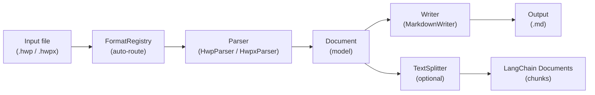
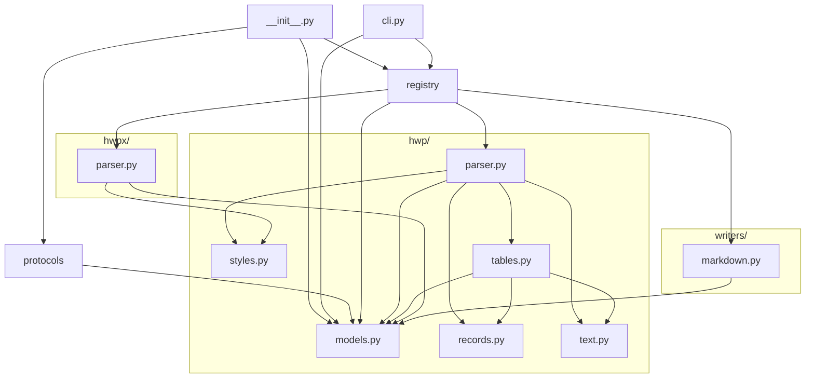
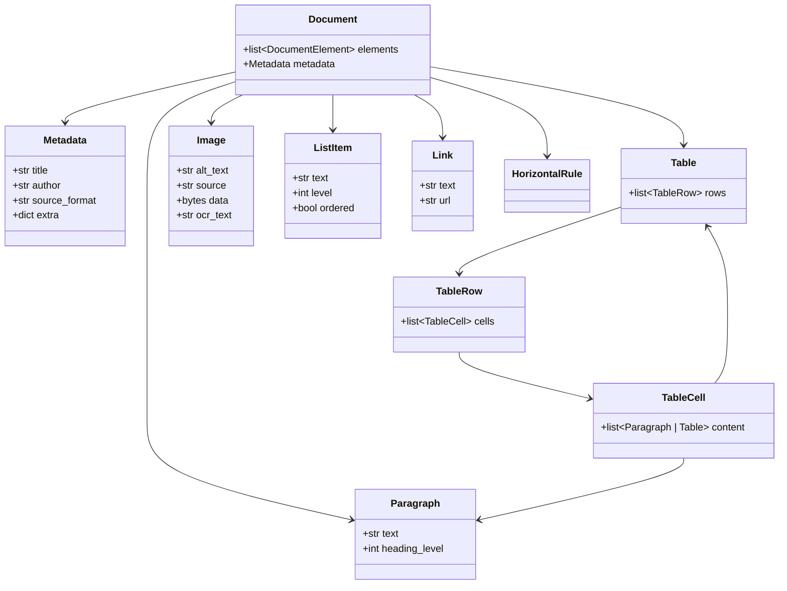
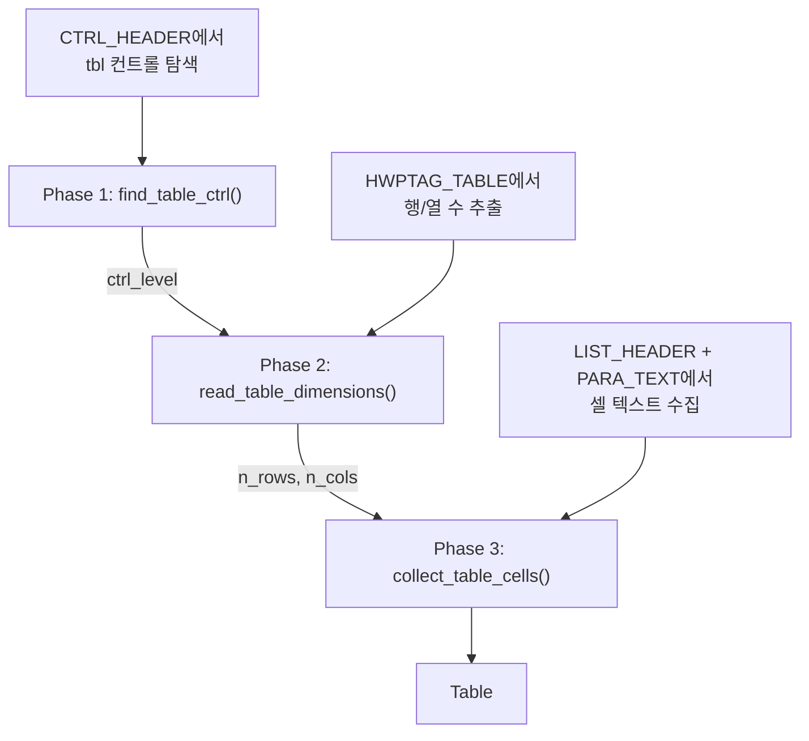

# Architecture

## Pipeline



## Module Dependency Graph



핵심 원칙: **파서와 Writer는 `models.py`에만 의존**한다. 서로를 직접 import하지 않는다.

## Document Model



## FormatRegistry

`FormatRegistry`는 파서와 Writer를 중앙에서 관리한다.

- **파서 등록**: 파일 확장자(`.hwp`, `.hwpx`)를 키로 파서 클래스를 매핑
- **Writer 등록**: 포맷 이름(`markdown`)을 키로 Writer 클래스를 매핑
- **자동 등록**: `get_registry()` 최초 호출 시 `_auto_register()`가 내장 파서/Writer를 등록
- **선택적 의존성**: `try/except ImportError`로 처리하여 없는 의존성은 건너뜀

## Protocol 기반 인터페이스

ABC 대신 `typing.Protocol`을 사용하여 구조적 서브타이핑을 구현한다.

```python
class Parser(Protocol):
    @staticmethod
    def extensions() -> list[str]: ...
    @staticmethod
    def parse(filepath: Path | str) -> Document: ...

class Writer(Protocol):
    @staticmethod
    def format_name() -> str: ...
    @staticmethod
    def file_extension() -> str: ...
    @staticmethod
    def write(doc: Document) -> str: ...
```

- 상속 불필요 — 메서드 시그니처만 맞으면 Protocol 호환
- `@staticmethod` — 현재 파서/Writer가 모두 무상태이므로 인스턴스 불필요

## HWP 파서 내부 구조

### Record 파싱

HWP 바이너리는 레코드 스트림이다. 각 레코드의 헤더는 4바이트:

```
[tag: 10비트][level: 10비트][size: 12비트]
```

`size == 0xFFF`이면 다음 4바이트가 실제 크기를 담는다.

### Character 스캐닝

`scan_para_chars()`는 PARA_TEXT 바이트를 순회하여 `CharInfo`를 yield한다. 확장 제어문자(16바이트)와 일반 문자(2바이트)를 구분한다.

`extract_text()`와 `has_table_marker()`는 모두 이 제너레이터를 사용하여 중복 로직을 제거했다.

### 테이블 파싱 3단계



### RecordCursor

인덱스 기반 `while i < n` 대신 `RecordCursor` 클래스로 명시적 순회를 구현한다.
