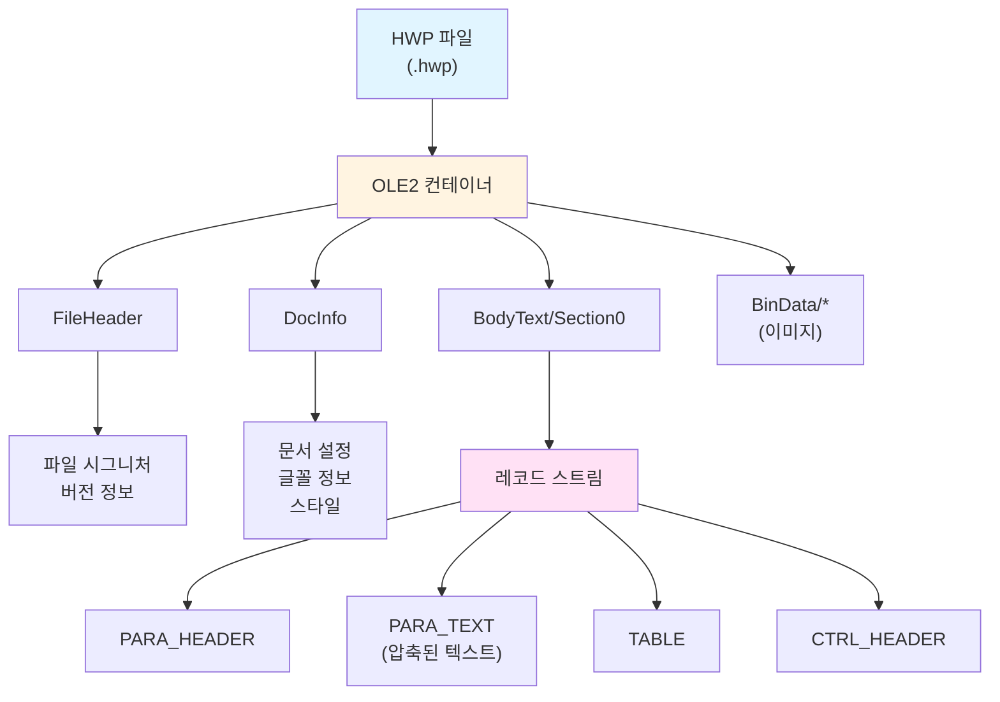
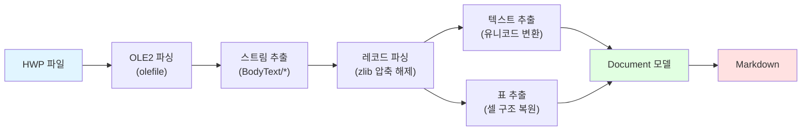

# HWP 포맷

## 개요

HWP(한글과컴퓨터 워드프로세서)는 대한민국에서 가장 널리 사용되는 워드프로세서 포맷이에요. HWP v5(아래한글 2007 이후)는 바이너리 형식으로, OLE2 컨테이너 안에 압축된 레코드 스트림을 담고 있어요.

### 주요 특징

- **바이너리 포맷** — 사람이 읽을 수 없는 이진 형식이에요
- **레코드 기반 구조** — 문단, 표, 이미지 등이 레코드 단위로 저장돼요
- **압축 지원** — zlib 압축을 사용해서 파일 크기를 줄여요
- **풍부한 메타데이터** — 작성자, 제목, 생성 일시 등을 포함해요

### 언제 사용하나요?

- 정부/공공기관 문서 (공문, 보고서 등)
- 학교 과제 및 논문
- 기업 내부 문서
- 한국어 텍스트 중심의 공식 문서

## 파일 구조

HWP 파일은 다층 구조로 이루어져 있어요.



## 파싱 방식

`ureca_document_parser`는 다음 단계로 HWP 파일을 파싱해요.



!!! info "내부 구조에 대한 자세한 설명"
    레코드 파싱, 문자 스캐닝, 테이블 추출 알고리즘 등 내부 구조가 궁금하다면 [아키텍처 문서](../reference/architecture.md)를 참고하세요.

## 사용 예시

### CLI로 변환하기

```bash
uv run ureca_document_parser 보고서.hwp -o 보고서.md
```

출력 파일을 지정하지 않으면 표준 출력으로 결과가 나와요.

```bash
uv run ureca_document_parser 보고서.hwp
```

### Python API로 변환하기

#### 파일로 저장

```python
from ureca_document_parser import convert

convert("보고서.hwp", "output/보고서.md")
```

#### 문자열로 반환

```python
from ureca_document_parser import convert

markdown_text = convert("보고서.hwp")
print(markdown_text)
```

#### LangChain 청크로 반환

```python
from ureca_document_parser import convert

chunks = convert("보고서.hwp", chunks=True, chunk_size=1000, chunk_overlap=200)
for chunk in chunks:
    print(chunk.page_content)
```

자세한 내용은 [Python API 가이드](../guides/python-api.md)와 [LangChain 연동 가이드](../guides/langchain.md)를 참고하세요.

## 제한사항

현재 버전에서는 다음 기능을 지원하지 않아요.

- 이미지 추출 (대체 텍스트만 표시)
- 도형 및 차트
- 머리글/바닥글
- 각주/미주
- 복잡한 표 병합 구조

## 다음 단계

- [HWPX 포맷](hwpx.md) — 최신 한글 OOXML 형식
- [Python API 가이드](../guides/python-api.md) — 더 많은 사용 예시
- [LangChain 연동](../guides/langchain.md) — RAG 파이프라인 구축
