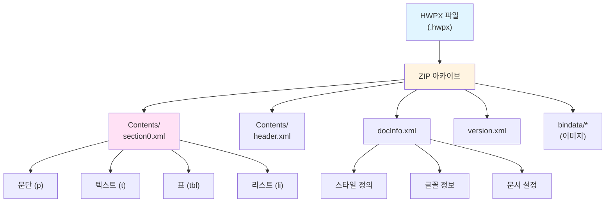
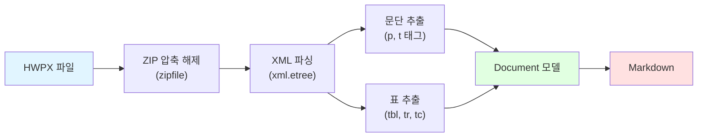

# HWPX 포맷

## 개요

HWPX는 아래한글의 최신 파일 포맷으로, Microsoft Office의 OOXML(Open Office XML)과 유사한 구조를 가지고 있어요. ZIP 압축 내부에 XML 파일들을 담고 있어서 사람이 읽을 수 있고, 다른 도구로도 처리하기 쉬워요.

### 주요 특징

- **개방형 표준** — XML 기반으로 구조가 명확해요
- **ZIP 압축** — 파일 크기를 효율적으로 관리해요
- **상호운용성** — 다른 도구와 연동이 쉬워요
- **버전 관리 친화적** — 텍스트 기반이라 Git 같은 VCS에서 diff를 볼 수 있어요

### HWP vs HWPX

| 특징 | HWP | HWPX |
|------|-----|------|
| 포맷 | 바이너리 | XML |
| 압축 | zlib (레코드별) | ZIP (파일 전체) |
| 가독성 | 불가능 | 가능 (압축 해제 후) |
| 호환성 | 아래한글 2007+ | 아래한글 2014+ |
| 파싱 복잡도 | 높음 | 낮음 |
| 외부 의존성 | olefile 필요 | 표준 라이브러리만 |

!!! tip "포맷 선택 가이드"
    - **HWP**: 기존에 작성된 오래된 문서, 공공기관 양식
    - **HWPX**: 새로 작성하는 문서, 버전 관리가 필요한 경우, 다른 도구와 연동할 때

## 파일 구조

HWPX 파일은 ZIP 아카이브 내부에 여러 XML 파일을 담고 있어요.



## 파싱 방식

`ureca_document_parser`는 표준 라이브러리만 사용해서 HWPX를 파싱해요.



!!! info "추가 의존성 불필요"
    HWPX 파싱은 Python 표준 라이브러리(`zipfile`, `xml.etree.ElementTree`)만 사용하므로 추가 패키지 설치가 필요 없어요.

## 사용 예시

### CLI로 변환하기

```bash
uv run ureca_document_parser 제안서.hwpx -o 제안서.md
```

출력 파일을 지정하지 않으면 표준 출력으로 결과가 나와요.

```bash
uv run ureca_document_parser 제안서.hwpx
```

### Python API로 변환하기

#### 파일로 저장

```python
from ureca_document_parser import convert

convert("제안서.hwpx", "output/제안서.md")
```

#### 문자열로 반환

```python
from ureca_document_parser import convert

markdown_text = convert("제안서.hwpx")
print(markdown_text)
```

#### 여러 파일 일괄 변환

```python
from pathlib import Path
from ureca_document_parser import convert

hwpx_files = Path("documents").glob("*.hwpx")

for hwpx_file in hwpx_files:
    output = Path("output") / hwpx_file.with_suffix(".md").name
    convert(hwpx_file, output)
    print(f"변환 완료: {hwpx_file.name} → {output.name}")
```

#### LangChain 청크로 반환

```python
from ureca_document_parser import convert

chunks = convert("제안서.hwpx", chunks=True, chunk_size=1000, chunk_overlap=200)
for chunk in chunks:
    print(chunk.page_content)
```

자세한 내용은 [Python API 가이드](../guides/python-api.md)와 [LangChain 연동 가이드](../guides/langchain.md)를 참고하세요.

## 지원 기능

다음은 HWPX 포맷에서 지원하는 기능과 제한사항이에요.

| 기능 | 상태 | 설명 |
|------|------|------|
| 텍스트 추출 | ✅ | XML 기반으로 텍스트를 정확하게 추출해요 |
| 문단 구조 | ✅ | 문단 단위로 구조화해서 추출해요 |
| 제목 인식 | ✅ | 스타일 기반으로 제목 레벨을 자동 인식해요 |
| 표 추출 | ⚠️ | 기본 표 구조를 지원하지만, 복잡한 병합 구조는 제한적이에요 |
| 리스트 | ✅ | 순서 있는/없는 리스트를 지원해요 |
| 메타데이터 | ✅ | 작성자, 제목, 생성 일시 등을 추출해요 |
| 이미지 | ❌ | 이미지 추출은 지원하지 않아요 (대체 텍스트만 표시) |
| 도형/차트 | ❌ | 도형과 차트는 지원하지 않아요 |
| 머리글/바닥글 | ❌ | 머리글과 바닥글은 추출하지 않아요 |
| 각주/미주 | ❌ | 각주와 미주는 지원하지 않아요 |
| 수식 | ❌ | 한글 수식 편집기로 작성된 수식은 지원하지 않아요 |

!!! info "HWP보다 정확한 파싱"
    HWPX는 XML 기반이라 HWP 바이너리보다 파싱이 더 정확하고 안정적이에요.

## 다음 단계

- [HWP 포맷](hwp.md) — 레거시 한글 바이너리 형식
- [Python API 가이드](../guides/python-api.md) — 더 많은 사용 예시
- [LangChain 연동](../guides/langchain.md) — RAG 파이프라인 구축
