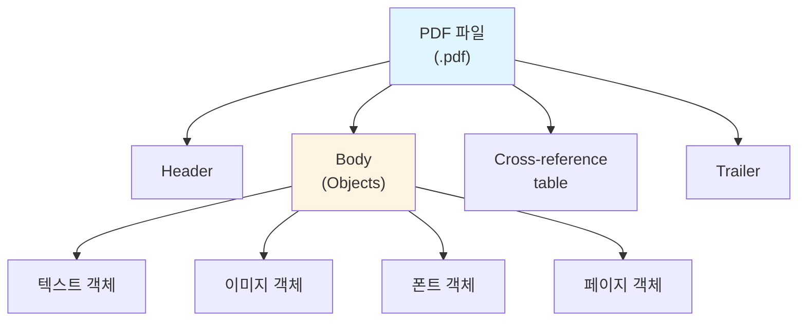
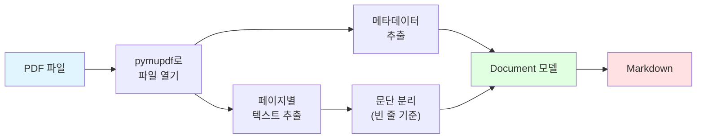

# PDF 포맷

## 개요

PDF(Portable Document Format)는 Adobe가 개발한 문서 포맷으로, 전 세계에서 가장 널리 사용되는 문서 형식 중 하나예요.

### 주요 특징

- **범용성** — 모든 운영체제와 기기에서 동일하게 표시돼요
- **텍스트 추출** — 문서의 텍스트 내용을 추출할 수 있어요
- **메타데이터** — 제목, 작성자, 생성 도구 등의 정보를 포함해요
- **다중 페이지** — 여러 페이지로 구성된 문서를 지원해요

### 언제 사용하나요?

- 전자 문서 (계약서, 보고서 등)
- 논문 및 출판물
- 전자책 및 매뉴얼
- 공공기관 배포 문서

## 파일 구조

PDF는 바이너리 형식으로 이루어져 있어요.



## 파싱 방식

`ureca_document_parser`는 pymupdf (fitz)를 사용해서 PDF를 파싱해요.



!!! info "pymupdf가 필요해요"
    PDF 파싱은 pymupdf (fitz) 라이브러리를 사용하므로 추가 설치가 필요해요.

    ```bash
    uv add "ureca_document_parser[pdf]"
    ```

## 사용 예시

### CLI로 변환하기

```bash
uv run ureca_document_parser document.pdf -o document.md
```

출력 파일을 지정하지 않으면 표준 출력으로 결과가 나와요.

```bash
uv run ureca_document_parser document.pdf
```

### Python API로 변환하기

#### 파일로 저장

```python
from ureca_document_parser import convert

convert("document.pdf", "output/document.md")
```

#### 문자열로 반환

```python
from ureca_document_parser import convert

markdown_text = convert("document.pdf")
print(markdown_text)
```

#### 여러 파일 일괄 변환

```python
from pathlib import Path
from ureca_document_parser import convert

pdf_files = Path("documents").glob("*.pdf")

for pdf_file in pdf_files:
    output = Path("output") / pdf_file.with_suffix(".md").name
    convert(pdf_file, output)
    print(f"변환 완료: {pdf_file.name} → {output.name}")
```

#### LangChain 청크로 반환

```python
from ureca_document_parser import convert

chunks = convert("document.pdf", chunks=True, chunk_size=1000, chunk_overlap=200)
for chunk in chunks:
    print(chunk.page_content)
```

자세한 내용은 [Python API 가이드](../guides/python-api.md)와 [LangChain 연동 가이드](../guides/langchain.md)를 참고하세요.

## 지원 기능

다음은 PDF 포맷에서 지원하는 기능과 제한사항이에요.

| 기능 | 상태 | 설명 |
|------|------|------|
| 텍스트 추출 | ✅ | 페이지별로 텍스트를 추출해요 |
| 문단 구조 | ⚠️ | 빈 줄을 기준으로 문단을 구분해요 (레이아웃에 따라 부정확할 수 있어요) |
| 제목 인식 | ❌ | PDF는 제목 정보를 명시적으로 포함하지 않아 자동 인식이 어려워요 |
| 표 추출 | ❌ | 표 구조를 인식하지 못하고 텍스트로만 추출돼요 |
| 리스트 | ⚠️ | 리스트 마커를 텍스트로 추출하지만 구조화하지는 않아요 |
| 메타데이터 | ✅ | 제목, 작성자, 생성 도구 등을 추출해요 |
| 이미지 | ❌ | 이미지 추출은 지원하지 않아요 |
| 도형/차트 | ❌ | 도형과 차트는 지원하지 않아요 |
| 수식 | ❌ | LaTeX 등의 수식은 지원하지 않아요 |
| 주석/하이라이트 | ❌ | PDF 주석과 하이라이트는 추출하지 않아요 |
| 다단 레이아웃 | ❌ | 복잡한 다단 구성은 텍스트 순서가 올바르지 않을 수 있어요 |

!!! warning "레이아웃 제한"
    PDF는 페이지 레이아웃 정보가 명확하지 않아서, 복잡한 구조의 문서는 텍스트 추출 순서가 올바르지 않을 수 있어요.

## 다음 단계

- [HWP 포맷](hwp.md) — 한글 바이너리 형식
- [HWPX 포맷](hwpx.md) — 한글 OOXML 형식
- [Python API 가이드](../guides/python-api.md) — 더 많은 사용 예시
- [LangChain 연동](../guides/langchain.md) — RAG 파이프라인 구축
