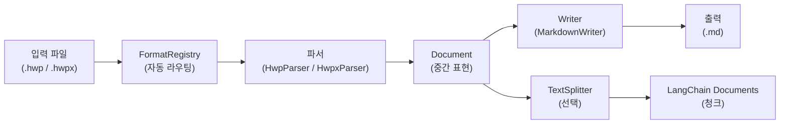
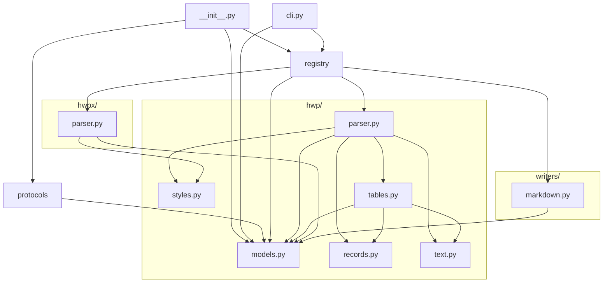
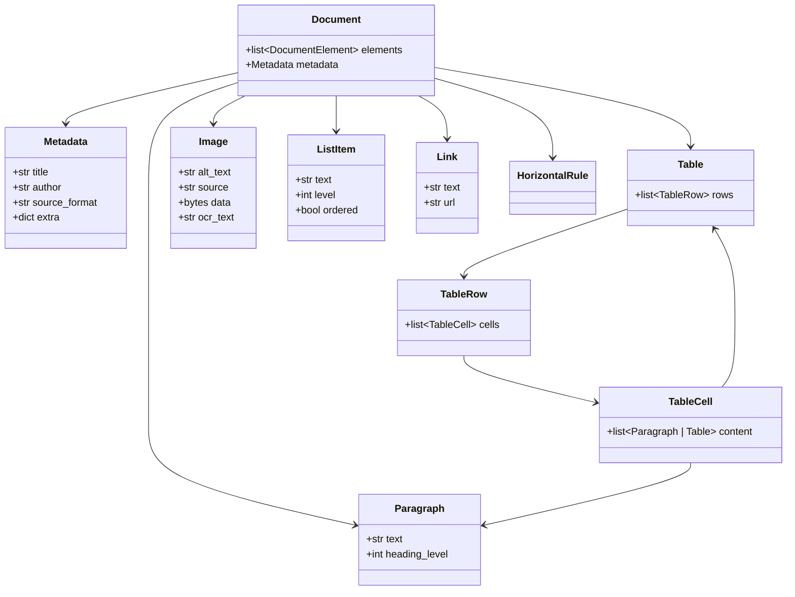
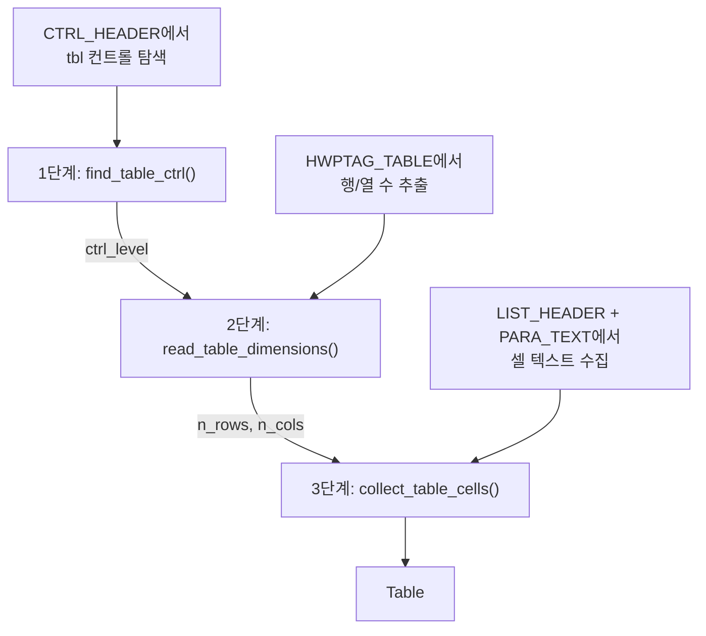
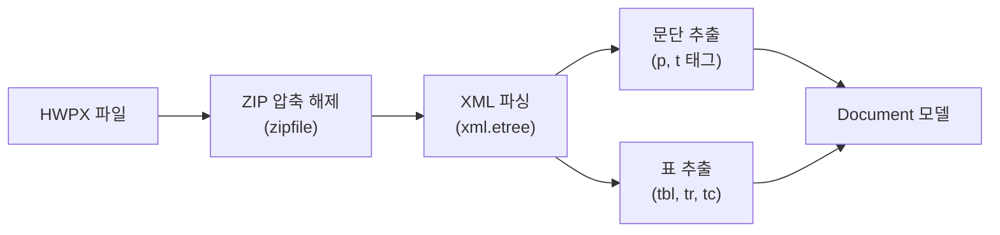

# 아키텍처

!!! info "대상 독자"
    이 문서는 라이브러리 내부 구조를 깊이 이해하고 싶거나, 기여하려는 개발자를 위한 기술 참조 문서예요.

## 전체 파이프라인

입력 파일이 변환되는 전체 흐름이에요.



## 디렉토리 구조

```
src/ureca_document_parser/
├── __init__.py        # 공개 API (convert, convert_to_chunks, get_registry)
├── __main__.py        # python -m ureca_document_parser
├── cli.py             # CLI (argparse, 레지스트리 기반 자동 라우팅)
├── models.py          # Document 모델 (Paragraph, Table, Image, ListItem, ...)
├── protocols.py       # Parser / Writer Protocol (구조적 서브타이핑)
├── registry.py        # FormatRegistry (확장자→파서, 포맷명→Writer 매핑)
├── styles.py          # 공유 헤딩 패턴
├── hwp/
│   ├── __init__.py    # HwpParser 및 저수준 타입 re-export
│   ├── parser.py      # HWP v5 바이너리 파서 (olefile) — 오케스트레이션
│   ├── records.py     # 바이너리 레코드 파싱 (Record, RecordCursor, 상수)
│   ├── text.py        # 문자 스캐닝 및 텍스트 추출 (CharInfo, BSTR)
│   └── tables.py      # 3단계 테이블 추출
├── hwpx/
│   ├── __init__.py    # HwpxParser re-export
│   └── parser.py      # HWPX 파서 (zipfile + xml.etree)
└── writers/
    └── markdown.py    # Markdown 작성기
```

## 모듈 의존성

각 모듈이 어떤 모듈에 의존하는지 보여줘요.



**핵심 원칙**: 파서와 Writer는 `models.py`에만 의존해요. 서로를 직접 import하지 않아요.

## Document 모델 (중간 표현)

`Document`는 파싱 결과의 중간 표현(IR)이에요. 모든 파서는 이 모델을 생산하고, 모든 Writer는 이 모델을 소비해요.



## FormatRegistry

`FormatRegistry`는 파서와 Writer를 중앙에서 관리하는 레지스트리예요.

### 주요 역할

- **파서 등록** — 파일 확장자(`.hwp`, `.hwpx`)를 키로 파서 클래스를 매핑
- **Writer 등록** — 포맷 이름(`markdown`)을 키로 Writer 클래스를 매핑
- **자동 등록** — `get_registry()` 최초 호출 시 `_auto_register()`가 내장 파서/Writer를 등록
- **선택적 의존성** — `try/except ImportError`로 처리해서 없는 의존성은 건너뜀

### 싱글톤 패턴

```python
_registry_instance = None
_registry_lock = Lock()

def get_registry() -> FormatRegistry:
    global _registry_instance
    if _registry_instance is None:
        with _registry_lock:
            if _registry_instance is None:
                _registry_instance = FormatRegistry()
                _auto_register(_registry_instance)
    return _registry_instance
```

스레드 안전 더블 체크 락킹으로 싱글톤을 구현했어요.

## Protocol 기반 인터페이스

ABC 대신 `typing.Protocol`을 사용해서 구조적 서브타이핑을 구현했어요.

```python
from typing import Protocol

class Parser(Protocol):
    @staticmethod
    def extensions() -> list[str]: ...

    @staticmethod
    def parse(filepath: Path | str) -> Document: ...

class Writer(Protocol):
    @staticmethod
    def format_name() -> str: ...

    @staticmethod
    def file_extension() -> str: ...

    @staticmethod
    def write(doc: Document) -> str: ...
```

**장점**:
- 상속이 필요 없어요 — 메서드 시그니처만 맞으면 Protocol과 호환
- `@staticmethod` 사용 — 현재 파서/Writer가 모두 무상태이므로 인스턴스가 불필요

## HWP 파서 내부 구조

### 레코드 파싱

HWP 바이너리는 레코드 스트림이에요. 각 레코드의 헤더는 4바이트로 구성돼요.

```
[tag: 10비트][level: 10비트][size: 12비트]
```

`size == 0xFFF`이면 다음 4바이트가 실제 크기를 담고 있어요.

### 문자 스캐닝

`scan_para_chars()`는 PARA_TEXT 바이트를 순회하며 `CharInfo`를 yield해요. 확장 제어문자(16바이트)와 일반 문자(2바이트)를 올바르게 구분해요.

`extract_text()`와 `has_table_marker()`는 모두 이 제너레이터를 사용해서 중복 로직을 제거했어요.

### 테이블 파싱 3단계

테이블은 세 단계에 걸쳐 파싱돼요.



### RecordCursor

인덱스 기반 `while i < n` 대신 `RecordCursor` 클래스로 명시적 순회를 구현했어요.

```python
class RecordCursor:
    def __init__(self, records: list[Record]):
        self.records = records
        self.pos = 0

    def next(self) -> Record | None:
        if self.pos < len(self.records):
            rec = self.records[self.pos]
            self.pos += 1
            return rec
        return None

    def peek(self) -> Record | None:
        if self.pos < len(self.records):
            return self.records[self.pos]
        return None
```

## HWPX 파서 구조

HWPX는 ZIP+XML 기반이라 HWP보다 파싱이 간단해요.



표준 라이브러리만 사용하므로 추가 의존성이 필요 없어요.

## Markdown Writer

`MarkdownWriter`는 `Document`를 GitHub Flavored Markdown으로 변환해요.

### 주요 기능

- 헤딩 레벨 변환 (`heading_level` → `#` 개수)
- 표 변환 (GFM 표 문법)
- 리스트 그룹핑 (연속된 `ListItem`을 하나의 블록으로)
- 코드 블록 이스케이핑

### 리스트 그룹핑

연속된 `ListItem`을 하나의 Markdown 리스트 블록으로 그룹핑해요.

```python
# 입력 (Document)
[
    ListItem(text="항목 1", level=0, ordered=False),
    ListItem(text="항목 2", level=0, ordered=False),
    Paragraph(text="일반 문단"),
]

# 출력 (Markdown)
"""
- 항목 1
- 항목 2

일반 문단
"""
```

## 테스트 전략

- **단위 테스트** — 각 모듈별 순수 함수 테스트
- **통합 테스트** — 실제 HWP/HWPX 파일로 end-to-end 테스트
- **픽스처** — `tests/fixtures/` 디렉토리에 샘플 파일 보관

## 다음 단계

- [포맷 확장하기](extending.md) — 새 파서/Writer 추가하는 법
- [API 레퍼런스](../api-reference.md) — 전체 API 문서
